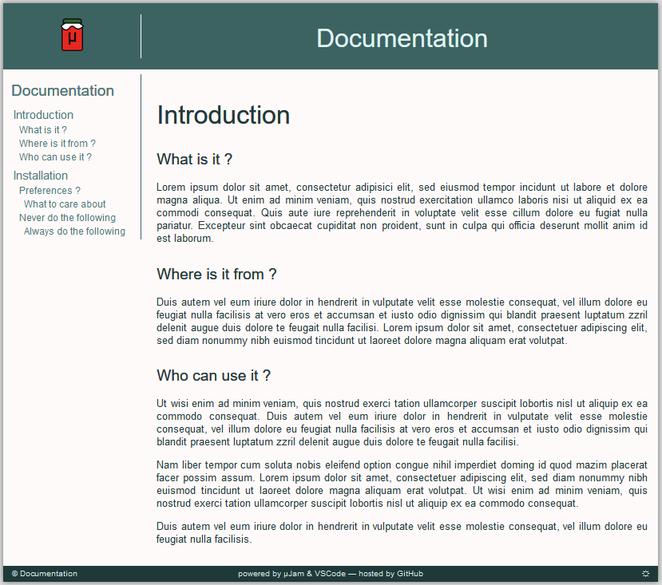

#  A documentation theme for &mu;jam with sidebar

* ## &mu; ... what ?

Greek letter `'μ'` is pronounced `'my'` as in `micro` or `'mee'` according to [modern Greek](https://www.thoughtco.com/the-greek-alphabet-1705558) . So simply call it *'microjam'* or *'myjam'*.

* ## ok ... myjam ?

`'jam'` comes from `Jamstack` and means the collection of the three attributes
* **J** avaScript
* **A** PI
* **M** arkup

It is mostly about the creation of *static* and *serverless* websites and you might want to [read more](https://jamstack.org/) about that modern way to build lightweight web pages [here](https://jamstack.wtf/).

* ## what can I do with ... myjam ?

If you want to 
* create a small to medium web site
* write down the contents of your web pages in that easy to learn and use Markdown language
* publish your web-pages to your GitHub repository and GitHub pages
* do that all from inside free [*Visual Studio Code*](https://code.visualstudio.com/) (`vscode`) editor

then the minimalistic and powerful approach of **&mu;jam** might convice you.

A [&mu;Jam](https://goessner.github.io/microjam/) template for web based project or product documentation. Different markdown documentation files are accessible via a common sidebar.

You can see it live and read more [here](https://goessner.github.io/microjam-docs/introduction.html) .