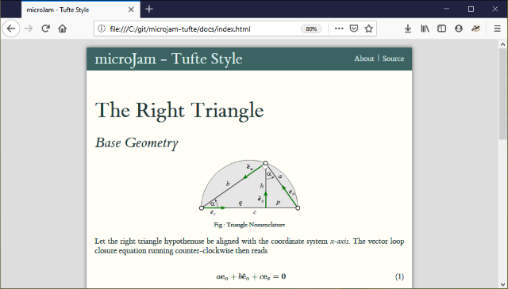
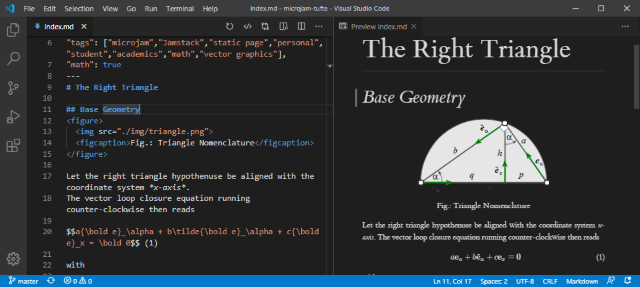

 #  &mu;Jam

## Qu'est ce que c'est  ?

**&mu;Jam** permet d'utiliser *Visual Studio Code* comme un outil pour création, publication ou édition de petits et moyens sites web.

La lettre grèque `'μ'` se prononce `'my'` comme en `micro`, `'mu'` comme en `'music'` ou `'mee'` en accord avec l'alphabet grèque [modern Greek](https://www.thoughtco.com/the-greek-alphabet-1705558). Dans ce contexte ici, il signifie simplement *miniscule* ou *minimalististe*.

Ce `'Jam'` dans &mu;Jam vient de `Jamstack` et signifie une collection de trois (03) attributs:
* **J** avaScript
* **A** PI
* **M** arkup

Il s'agit principalement de la création de pages Web statiques ou de sites Web *sans serveur* vous voudrez peut etre [lire plus](https://jamstack.org/) à propos de cette façon de construire des pages web légères [here](https://jamstack.wtf/) et [ici](https://jamstack.email/).

## Que puis-je faire avec cela ?

Si vous voulez 
* Creer un petit à un moyen site web 
* Ecrire le contenu de vos sites web. Pour cela il sera facile d apprende à utiliser [Markdown language](https://commonmark.org/help/)
* Publier votre page web dans votre  GitHub repository et [pages GitHub](https://pages.github.com/)
* Faire tout ceci dans votre éditeur gratuit [*Visual Studio Code*](https://code.visualstudio.com/) (`vscode`)

Dès lors que l'approche minimaliste et puissante de &mu;Jam pourrais vous convaincre.

  

## Exemples ?

Some templates are here ...

* [microjam-simple](https://github.com/goessner/microjam-simple) &ndash; un modèle de site web simple pour μJam
* [microjam-tufte](https://github.com/goessner/microjam-tufte) &ndash; un modèle de *style Tufte* pour μJam
* [microjam-docs](https://github.com/goessner/microjam-docs) &ndash; une documentation de themes pour μjam avec sidebar
* [microjam-g2](https://github.com/goessner/microjam-docs) &ndash; un theme pour μjam + g2

## Pourquoi une autre approche Jamstack?

**&mu;Jam** est censé etre un [code faible](https://en.wikipedia.org/wiki/Low-code_development_platform) un outil d'édition et de publication web pour les scientifiques, les ingénieurs et les étudiants qui ...

> *  facile à apprendre et à utiliser. 
> *  ne nécessite pas de compétences en programmation web.
> *  peut gérer les expressions mathématiques Latex natif.
> *  intègre des graphiques vectoriels statiques ou dynamiques.
> *  intègre les capacités de scripts.
> *  offre un aperçu Html confortable.
> *  prend en charge différents modèles et styles.
> *  permet une sortie format "pdf" de papier de recherche de haute qualité.
> *  faire tout cela à l'intérieur d'un éditeur professionel *Markdown* doing that all inside of a professional markdown authoring application.

Mais vous avez la possibilité de laisser que *math*, *vecteurs graphiques* et *papier e recherche* stuff out, il peut aussi bien servir de souhaitd éditeur non-académique.

Etes-vous intéressés ... ?  Dans ce cas [lire plus](https://goessner.github.io/microjam/index.html) ...
